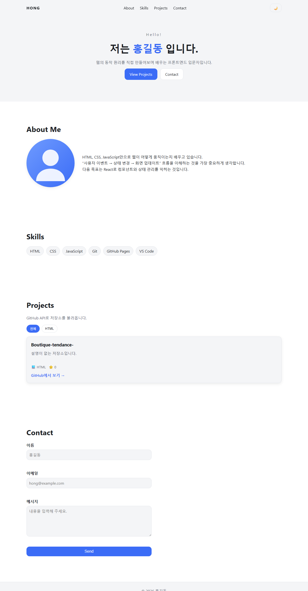
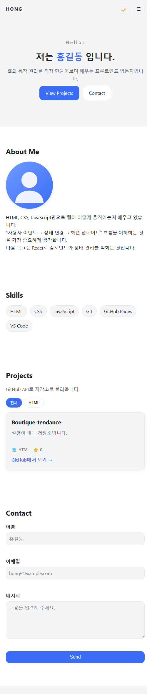
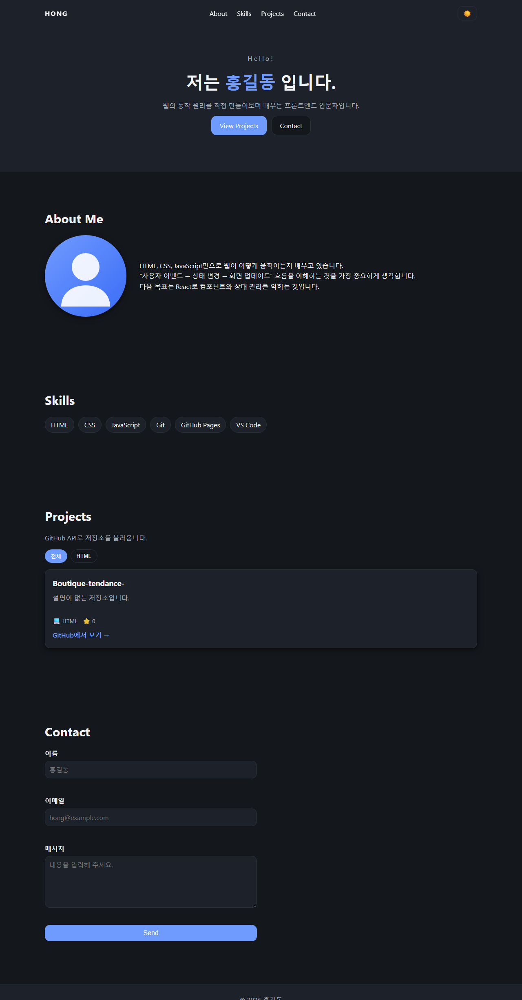

# 나를 소개하는 포트폴리오 웹사이트

외부 라이브러리 없이 **순수 HTML / CSS / JavaScript** 로 만든 반응형 포트폴리오입니다.
"사용자 이벤트 → 상태(state) 변경 → 화면 렌더링" 흐름을 직접 구현하는 것이 목표입니다.

## 배포 URL

- 사이트: https://quartz10.github.io/portfolio/
- 저장소: https://github.com/Quartz10/portfolio

## 사용 기술

- HTML5 시맨틱 태그 (`header`, `nav`, `main`, `section`, `article`, `footer`)
- CSS3 (CSS 변수, Flexbox, Grid, 미디어 쿼리, transition)
- JavaScript (ES6+, DOM 조작, 이벤트, `fetch` + `async/await`, `localStorage`, IntersectionObserver)
- GitHub REST API

## 폴더 구조

```
portfolio/
├─ index.html      # 메인 페이지
├─ css/style.css   # 스타일 (변수 · 레이아웃 · 반응형 · 다크모드)
├─ js/app.js       # 상태 · 이벤트 · 렌더링
├─ images/         # 이미지
└─ README.md
```

## 주요 기능

| 기능 | 동작 흐름 (이벤트 → 상태 → 렌더링) |
| --- | --- |
| 다크 모드 | 토글 클릭 → `state.theme` 변경 → `data-theme` 속성 교체 → CSS 변수 전체 변경 |
| GitHub 프로젝트 | 페이지 로드 → `state.projects.status` 가 loading/success/error/empty 로 변경 → Projects 영역 렌더링 |
| 폼 유효성 검사 | 입력·제출 → 필드별 검증 결과 → 에러 메시지 표시/숨김 |
| 언어 필터 | 필터 버튼 클릭 → `state.projects.filter` 변경 → 카드 목록 다시 렌더링 |
| 햄버거 메뉴 | 버튼 클릭 → `state.menuOpen` 변경 → `classList.toggle('active')` |

## 설정값 (자유 변경 가능 · 명시 필요 항목)

| 항목 | 값 | 위치 |
| --- | --- | --- |
| 네비게이션 배경 변경 기준 | 스크롤 **60px** | `js/app.js` → `HEADER_OFFSET` |
| 맨 위로 버튼 노출 기준 | 스크롤 **300px** | `js/app.js` → `TOP_BTN_OFFSET` |
| 스크롤 애니메이션 임계값 | `threshold: 0.2` | `js/app.js` → IntersectionObserver |
| 반응형 브레이크포인트 | 768px(태블릿) / 1024px(데스크톱) | `css/style.css` |
| 불러올 저장소 개수 | 최근 업데이트순 6개 | `js/app.js` → `per_page=6` |

## 실행 방법

1. VS Code 에서 이 폴더를 연다.
2. `Live Server` 확장을 설치한 뒤 `index.html` 에서 **Open with Live Server** 를 실행한다.
3. `js/app.js` 맨 위의 `GITHUB_USERNAME` 값(현재 `Quartz10`)으로 GitHub 저장소를 불러온다.

## GitHub API 주의사항

- 인증 없이 호출하면 **시간당 60회** 제한이 있습니다. 짧은 시간 안에 새로고침을 반복하지 마세요.
- 제한에 걸리면 403 응답이 오고, 화면에는 "프로젝트를 불러올 수 없습니다 + 다시 시도" 에러 UI가 표시됩니다.

## 스크린샷

### 데스크톱



### 모바일



### 다크 모드


